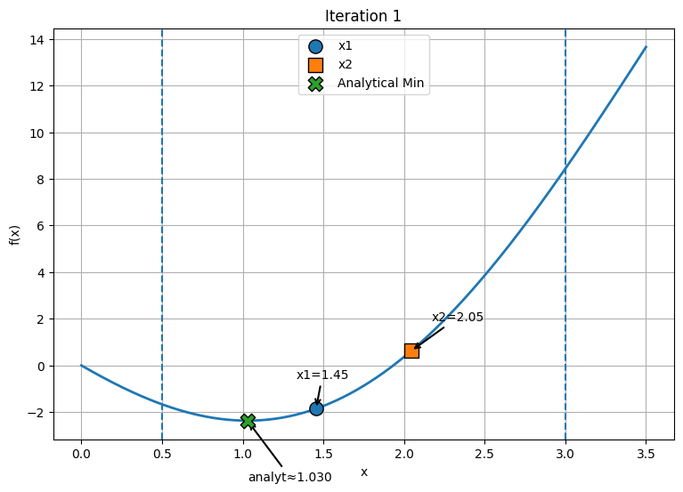
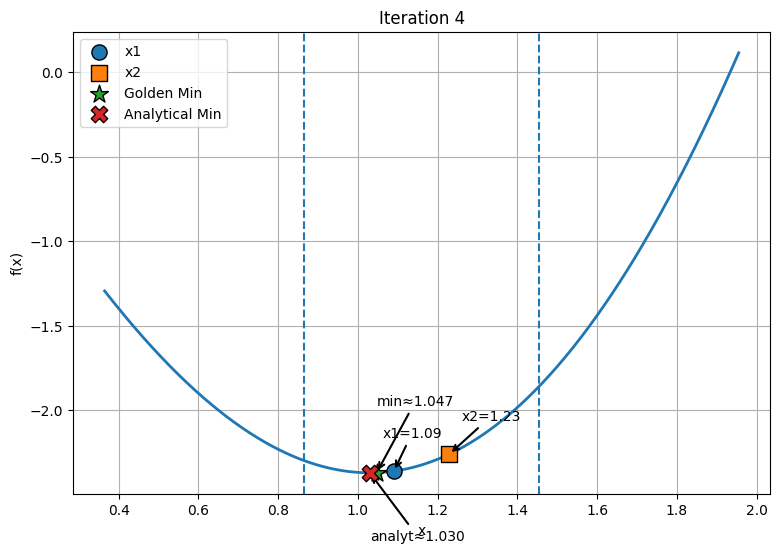
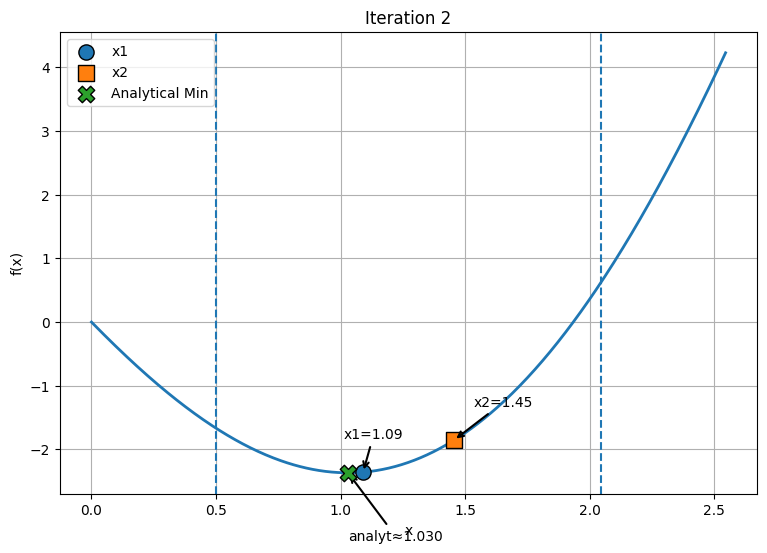
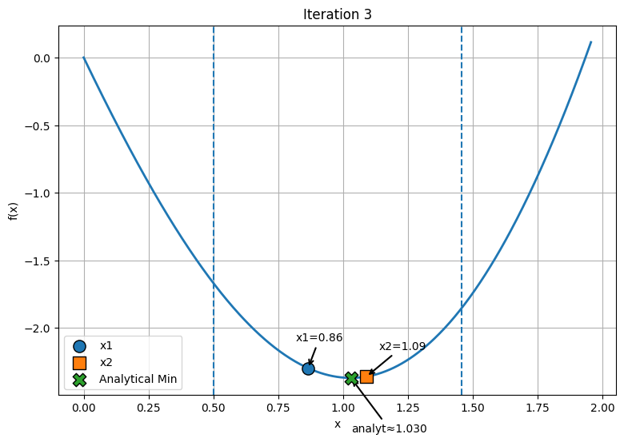

#  Golden Section Method

This project presents the **Golden Section Search method** for finding the minimum of a unimodal function on a given interval.

The method is an efficient optimization technique that does not require derivatives and progressively reduces the search interval to approximate the minimum with a desired accuracy.

---

##  Theory

The Golden Section Method is based on dividing a segment into two parts such that:

> the ratio of the entire segment to the larger part  
> equals the ratio of the larger part to the smaller part

This constant ratio is known as the **golden ratio**.

---

##  Golden Ratio

r = (√5 - 1) / 2 ≈ 0.618

Using this ratio ensures that the interval reduction is optimal at every iteration.

---

##  Algorithm Overview

Given an interval `[a, b]` and a unimodal function `f(x)`:

1. Compute two internal points:

x1 = b - r(b - a)
x2 = a + r(b - a)

2. Evaluate the function:
- If `f(x1) < f(x2)` → the minimum lies in `[a, x2]`
- Otherwise → `[x1, b]`

3. Repeat the process on the new interval

4. Stop when:
--
|b - a| < ε

---

## Example

Function:

f(x) = x² - 4sin(x)

Analytical minimum:

x ≈ 1.02987
f(x) ≈ -2.36830

---

## Iteration Visualizations

### Iteration 1

### Iteration 2

### Iteration 3

### Iteration 4

---

##  Advantages

- No derivatives required  
- Stable and robust  
- Easy to understand  
- Efficient interval reduction  

---

##  Limitations

- Applicable only to unimodal functions  
- Slower than derivative-based methods in some cases  
- Produces approximate results  

---

##  Conclusion

The Golden Section Method is a simple yet powerful optimization technique. It is especially useful when derivative information is unavailable, providing a reliable way to approximate the minimum of a function.
